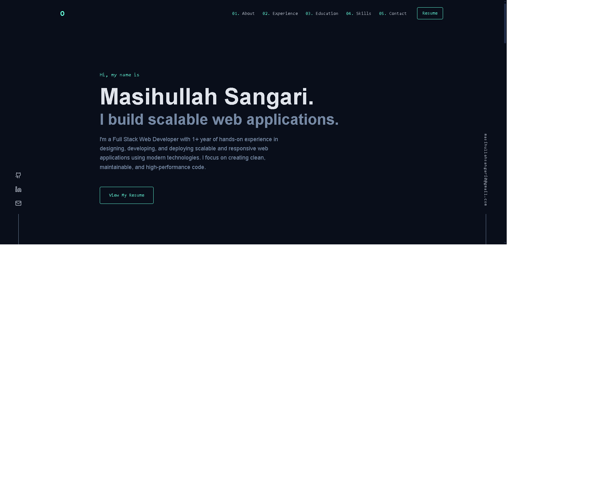
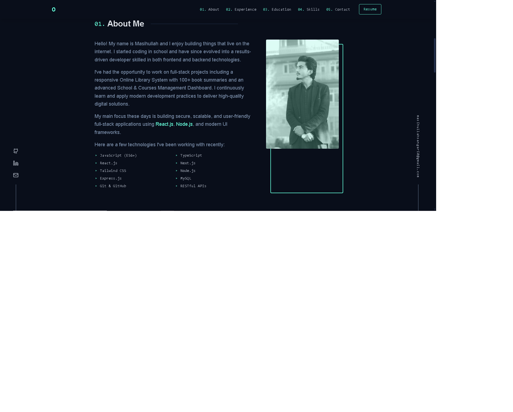

# 💼 Masihullah Sangari

### 🚀 Full-Stack Web Developer

I build modern, responsive, and high-performance web applications with a strong focus on clean UI, scalability, and user experience.

🔗 **Live Portfolio**
👉 [https://masihullahsangari.github.io/my-portfolio/](https://masihullahsangari.github.io/my-portfolio/)

---

## 👋 About Me

I am a passionate **Full-Stack Web Developer** who enjoys turning ideas into real-world products. I focus on writing clean, maintainable code and creating interfaces that feel smooth and intuitive.

This repository contains the source code for my personal portfolio website.

---

## 🛠️ Tech Stack

* ⚛️ **React**
* 🧠 **TypeScript**
* ⚡ **Vite**
* 🎨 **Tailwind CSS**
* 🔀 **React Router**
* 📦 **TanStack Query**
* ☁️ **GitHub Pages**

---

## 📸 Portfolio Preview

### 🏠 Home Page



### 👤 About Page



---

## 🚀 Getting Started

### 📥 Clone the repository

```bash
git clone https://github.com/MasihullahSangari/my-portfolio.git
cd my-portfolio
```

### 📦 Install dependencies

```bash
npm install
```

### ▶️ Run locally

```bash
npm run dev
```

The app will run at `http://localhost:5173`.

---

## 🌐 Deployment

This project is deployed using **GitHub Pages**.

```bash
npm run build
npm run deploy
```

---

## 📬 Contact

* 📧 **Email:** [masihullahsangari0@gmail.com](mailto:masihullahsangari0@gmail.com)
* 🌍 **Portfolio:** [https://masihullahsangari.github.io/my-portfolio/](https://masihullahsangari.github.io/my-portfolio/)

---

⭐ Feel free to explore the project, and thank you for visiting my portfolio!
